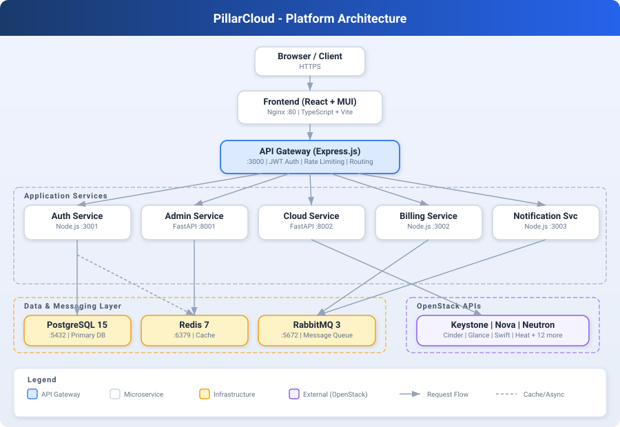
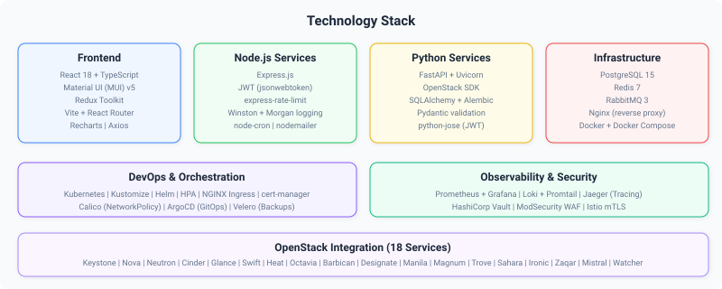
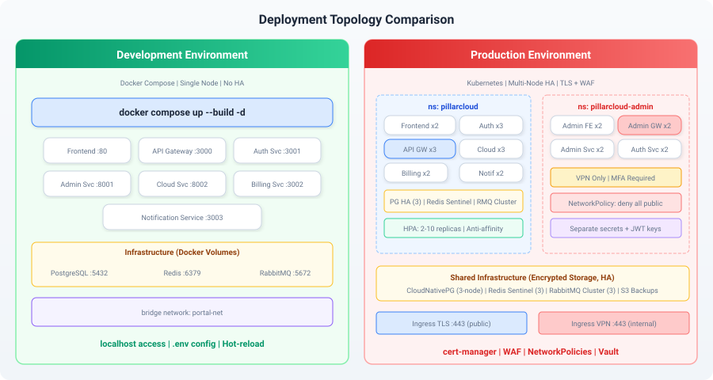
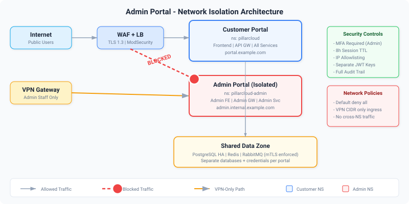

<p align="center">
  
</p>

<h1 align="center">PillarCloud</h1>

<p align="center">
  <strong>Enterprise Cloud Management, Admin & Billing Platform</strong><br/>
  Built on OpenStack | Microservices Architecture | Production-Ready
</p>

<p align="center">
  <a href="#quick-start"></a>
  <a href="#deploy-to-kubernetes"></a>
  <a href="docs/Cloud_Deployment_Spec.pdf"></a>
  
</p>

<p align="center">
  <a href="#architecture">Architecture</a>&nbsp;&bull;
  <a href="#quick-start">Quick Start</a>&nbsp;&bull;
  <a href="#deploy-to-kubernetes">Kubernetes</a>&nbsp;&bull;
  <a href="#admin-portal-isolation">Admin Isolation</a>&nbsp;&bull;
  <a href="#api-reference">API</a>&nbsp;&bull;
  <a href="#documentation">Docs</a>
</p>

---

## Overview

PillarCloud is a full-featured, multi-tenant cloud management platform that provides a unified web interface for managing OpenStack cloud infrastructure. It handles the complete lifecycle from resource provisioning to billing, with a dedicated, isolated admin portal for platform management.

### Key Capabilities

| Capability | Description |
|:-----------|:------------|
| **Cloud Resource Management** | Compute, Network, Storage, DNS, Load Balancers, Object Storage, and 12+ more OpenStack services |
| **Multi-Tenant Billing** | Hourly usage tracking, automated invoice generation, plan-based pricing (Basic/Standard/Enterprise) |
| **Administration** | Project management, quota allocation, user management, comprehensive audit logging |
| **Security** | JWT authentication, RBAC, rate limiting, Keystone integration, MFA support (admin) |
| **Observability** | Structured logging, health checks, Prometheus-ready metrics, distributed tracing |

---

## Architecture


<p align="center">
  
</p>

PillarCloud uses a **microservices architecture** with an API Gateway pattern. All services are containerized and deployable via Docker Compose (development) or Kubernetes (production).

### Services

| Service | Technology | Port | Responsibility |
|:--------|:-----------|:----:|:---------------|
| **API Gateway** | Node.js / Express | `3000` | JWT validation, rate limiting, request routing, CORS |
| **Auth Service** | Node.js / Express | `3001` | Login, user management, JWT issuance, Keystone integration |
| **Admin Service** | Python / FastAPI | `8001` | Projects, quotas, audit logging |
| **Cloud Service** | Python / FastAPI | `8002` | OpenStack SDK wrapper for 18 cloud services |
| **Billing Service** | Node.js / Express | `3002` | Usage tracking, invoice generation, plan pricing |
| **Notification Service** | Node.js | `3003` | RabbitMQ consumer, email notifications (nodemailer) |
| **Frontend** | React 18 / TypeScript | `80` | Web portal (Vite + MUI v5 + Redux Toolkit) |

### Infrastructure Dependencies

| Component | Version | Purpose |
|:----------|:--------|:--------|
| **PostgreSQL** | 15 | Primary relational data store |
| **Redis** | 7 | Rate limiting, token cache, session management |
| **RabbitMQ** | 3 | Asynchronous inter-service messaging |

### Request Flow

```
Client (Browser)
  |
  v
Frontend (React/Nginx :80)  -->  static assets, SPA routing
  |
  v  (proxies /api)
API Gateway (Express :3000)  -->  JWT auth, rate limit, route
  |
  +---> Auth Service (:3001)         --> Keystone / PostgreSQL
  +---> Admin Service (:8001)        --> PostgreSQL / RabbitMQ
  +---> Cloud Service (:8002)        --> OpenStack APIs
  +---> Billing Service (:3002)      --> PostgreSQL / RabbitMQ
  +---> Notification Service (:3003) --> RabbitMQ --> SMTP
```

---

## Tech Stack

<p align="center">
  
</p>

<details>
<summary><strong>Full Technology List</strong></summary>

| Layer | Technologies |
|:------|:------------|
| **Frontend** | React 18, TypeScript, Vite, Material UI v5, Redux Toolkit, React Router, Recharts, Axios |
| **Node.js Backend** | Express.js, jsonwebtoken, express-rate-limit, express-validator, Winston, Morgan, node-cron, nodemailer, amqplib, ioredis |
| **Python Backend** | FastAPI, Uvicorn, OpenStack SDK, SQLAlchemy, Alembic, Pydantic, python-jose, aio-pika |
| **Databases** | PostgreSQL 15 (uuid-ossp, pgcrypto), Redis 7 (AOF persistence) |
| **Messaging** | RabbitMQ 3 (management plugin) |
| **Containers** | Docker, Docker Compose, multi-stage Dockerfiles |
| **Orchestration** | Kubernetes, Kustomize, HPA, NGINX Ingress, cert-manager |
| **Observability** | Prometheus, Grafana, Loki, Jaeger (recommended stack) |

</details>

---

## Quick Start

### Prerequisites

- **Docker** v20.10+ with Docker Compose v2
- **Git** v2.30+
- *(Optional)* An accessible OpenStack environment -- the portal works without it; OpenStack API calls will fail gracefully

### 1. Clone & Configure

```bash
git clone <repository-url>
cd PillarCloud

# Create environment config
cp .env.example .env
# Edit .env -- set OS_AUTH_URL, OS_USERNAME, OS_PASSWORD, SMTP settings
```

### 2. Start All Services

```bash
# Recommended: use the dev-start script
./scripts/dev-start.sh

# Or manually:
docker compose up --build -d
```

### 3. Access the Portal

| URL | Service | Credentials |
|:----|:--------|:------------|
| [http://localhost](http://localhost) | Frontend UI | `admin` / `admin123` |
| [http://localhost:3000](http://localhost:3000) | API Gateway | JWT Bearer token |
| [http://localhost:8001/docs](http://localhost:8001/docs) | Admin Service (Swagger) | -- |
| [http://localhost:8002/docs](http://localhost:8002/docs) | Cloud Service (Swagger) | -- |
| [http://localhost:15672](http://localhost:15672) | RabbitMQ Management | `guest` / `guest` |
| localhost:5433 | PostgreSQL | `portal_user` / `portal_pass` |

### 4. Verify Health

```bash
curl -s http://localhost:3000/health | jq .
curl -s http://localhost:8001/health
curl -s http://localhost:8002/health
```

> **Default login:** `admin` / `admin123` -- **change these before any non-local deployment**.

---

## Project Structure

```
PillarCloud/
|-- docker-compose.yml            # Local development orchestration
|-- .env.example                  # Environment variable template
|
|-- services/
|   |-- api-gateway/              # Node.js + Express  (JWT, rate-limit, proxy)
|   |-- auth-service/             # Node.js + Express  (login, JWT, users)
|   |-- admin-service/            # Python + FastAPI   (projects, quotas, audit)
|   |-- cloud-service/            # Python + FastAPI   (OpenStack SDK wrapper)
|   |-- billing-service/          # Node.js + Express  (usage, invoices, cron)
|   `-- notification-service/     # Node.js + nodemailer (RabbitMQ consumer)
|
|-- frontend/                     # React 18 + TypeScript + Vite + MUI v5
|   |-- src/
|   |   |-- pages/
|   |   |   |-- Admin/            # Users, Projects, Quotas, Audit
|   |   |   |-- Cloud/            # Instances, Networks, Storage, DNS, LBs + 12 more
|   |   |   |-- Billing/          # Overview, Customers, Invoices
|   |   |   |-- Dashboard/        # Main dashboard
|   |   |   `-- Login/            # Authentication
|   |   |-- components/           # Shared UI components
|   |   |-- store/                # Redux Toolkit store
|   |   |-- services/             # API client services
|   |   `-- routes/               # React Router config
|   `-- Dockerfile                # Multi-stage: Node build -> Nginx serve
|
|-- k8s/
|   |-- base/                     # Base Kubernetes manifests
|   |   |-- namespace.yaml        #   Namespace definition
|   |   |-- configmap.yaml        #   Non-sensitive configuration
|   |   |-- secrets.yaml          #   Sensitive values (base64)
|   |   |-- postgres.yaml         #   PostgreSQL deployment + PVC
|   |   |-- redis.yaml            #   Redis deployment
|   |   |-- rabbitmq.yaml         #   RabbitMQ deployment + PVC
|   |   |-- services.yaml         #   All 7 service deployments + K8s services
|   |   |-- hpa.yaml              #   Horizontal Pod Autoscalers
|   |   `-- ingress.yaml          #   NGINX Ingress rules
|   `-- overlays/
|       `-- production/           #   Kustomize production overrides
|
|-- kubernetes/                   # Extended K8s manifests (per-resource)
|   |-- deployments/
|   |-- services/
|   |-- configmaps/
|   |-- secrets/
|   |-- hpa/
|   `-- ingress/
|
|-- scripts/
|   |-- build.sh                  # Build all Docker images
|   |-- deploy.sh                 # Apply all K8s manifests
|   |-- scale.sh                  # Manually scale a service
|   |-- dev-start.sh              # Start local dev environment
|   `-- setup-db.sh               # PostgreSQL initialization
|
`-- docs/
    |-- Cloud_Platform_Spec.docs             # Platform architecture spec
    |-- Admin_Module_Spec.docs               # Admin module spec
    |-- Customer_Lifecycle_Billing_Spec.docs  # Billing system spec
    |-- Cloud_Deployment_Spec.pdf            # Production deployment spec
    |-- Cloud_Platform_Deployment_Plan.pdf   # Step-by-step deployment plan
    `-- images/                              # Architecture diagrams
```

---

## Deploy to Kubernetes

<p align="center">
  
</p>

### 1. Build & Push Images

```bash
REGISTRY=registry.example.com/pillarcloud TAG=v1.0.0

# Build all images
REGISTRY=$REGISTRY TAG=$TAG ./scripts/build.sh

# Push all images
for svc in api-gateway auth-service admin-service cloud-service \
           billing-service notification-service frontend; do
  docker push $REGISTRY/$svc:$TAG
done
```

### 2. Configure Secrets

```bash
# Generate strong secrets
JWT_SECRET=$(openssl rand -hex 32)
PG_PASSWORD=$(openssl rand -base64 24)

# Create K8s secret
kubectl create secret generic portal-secrets \
  --namespace pillarcloud \
  --from-literal=POSTGRES_USER=portal_user \
  --from-literal=POSTGRES_PASSWORD=$PG_PASSWORD \
  --from-literal=JWT_SECRET=$JWT_SECRET \
  --from-literal=OS_USERNAME=<openstack-admin> \
  --from-literal=OS_PASSWORD=<openstack-password>
```

### 3. Deploy

```bash
# Apply all manifests in order
./scripts/deploy.sh

# Or step-by-step:
kubectl apply -f k8s/base/namespace.yaml
kubectl apply -f k8s/base/configmap.yaml
kubectl apply -f k8s/base/secrets.yaml
kubectl apply -f k8s/base/postgres.yaml
kubectl apply -f k8s/base/redis.yaml
kubectl apply -f k8s/base/rabbitmq.yaml
kubectl apply -f k8s/base/services.yaml
kubectl apply -f k8s/base/hpa.yaml
kubectl apply -f k8s/base/ingress.yaml
```

### 4. Verify

```bash
kubectl get pods -n pillarcloud
kubectl get svc -n pillarcloud
kubectl get hpa -n pillarcloud
kubectl get ingress -n pillarcloud
```

### 5. Configure Ingress & TLS

Update `k8s/base/ingress.yaml` with your domain. For TLS, add cert-manager annotations:

```yaml
metadata:
  annotations:
    cert-manager.io/cluster-issuer: letsencrypt-prod
spec:
  tls:
  - hosts: [portal.example.com]
    secretName: portal-tls
```

---

## Admin Portal Isolation

<p align="center">
  
</p>

**The Admin Portal is deployed as a completely separate instance** from the Customer Portal. This is a critical architectural decision for security and compliance.

### Why Separate?

| Reason | Detail |
|:-------|:-------|
| **Security isolation** | Admin operations (user mgmt, quotas, audit) are protected by additional security layers |
| **Blast radius reduction** | DDoS or breach on customer portal does not impact admin operations |
| **Compliance** | Regulatory frameworks require separation of duties for administrative functions |
| **Independent scaling** | Admin portal has different traffic patterns (low volume, high privilege) |
| **Maintenance** | Admin portal can be updated independently without customer-facing downtime |

### Admin Portal Configuration

| Aspect | Customer Portal | Admin Portal |
|:-------|:---------------|:-------------|
| **Namespace** | `pillarcloud` | `pillarcloud-admin` |
| **Access** | Public internet (HTTPS) | VPN-only (internal DNS) |
| **URL** | `portal.example.com` | `admin.internal.example.com` |
| **MFA** | Optional | **Required** |
| **Session TTL** | 24 hours | 8 hours |
| **Idle Timeout** | -- | 30 minutes |
| **JWT Keys** | Shared set | **Separate keys** |
| **Network Policy** | Standard ingress | Default deny + VPN CIDR allow |

### Admin Portal Services

- **Admin Frontend** -- React app with admin-only routes (Users, Projects, Quotas, Audit)
- **Admin API Gateway** -- Express.js with admin-specific middleware (IP allowlisting, stricter rate limits)
- **Admin Service** -- FastAPI for project management, quota allocation, and audit logging
- **Admin Auth Service** -- Separate auth instance with MFA enforcement

> See [docs/Cloud_Deployment_Spec.pdf](docs/Cloud_Deployment_Spec.pdf) Section 9 for full admin isolation specification.

---

## Scaling

### Automatic (HPA)

Horizontal Pod Autoscalers are pre-configured for production:

| Service | Min Replicas | Max Replicas | CPU Target |
|:--------|:------------|:------------|:-----------|
| API Gateway | 2 | 10 | 70% |
| Auth Service | 2 | 8 | 70% |
| Cloud Service | 2 | 8 | 70% |
| Frontend | 2 | 6 | 70% |

```bash
# View HPA status
kubectl get hpa -n pillarcloud

# Resource usage
kubectl top pods -n pillarcloud
```

### Manual

```bash
./scripts/scale.sh api-gateway 6
./scripts/scale.sh cloud-service 4
```

### Infrastructure Scaling (Production)

For production, replace single-instance data stores with HA equivalents:

| Component | Development | Production |
|:----------|:-----------|:-----------|
| **PostgreSQL** | Single container | CloudNativePG (3-node HA) or managed (RDS/CloudSQL) |
| **Redis** | Single container | Redis Sentinel (3-node) or managed (ElastiCache) |
| **RabbitMQ** | Single container | RabbitMQ Cluster Operator (3-node quorum) |

---

## API Reference

All requests route through the API Gateway at `/api/*`.

### Authentication

```bash
# Login
curl -X POST http://localhost:3000/api/auth/login \
  -H 'Content-Type: application/json' \
  -d '{"username": "admin", "password": "admin123"}'
# Returns: { token, refreshToken, user }

# Use token in subsequent requests
curl http://localhost:3000/api/cloud/instances \
  -H "Authorization: Bearer <token>"
```

### Endpoints

| Service | Base Path | Key Routes |
|:--------|:----------|:-----------|
| **Auth** | `/api/auth` | `POST /login`, `POST /register`, `GET /users`, `POST /refresh-token` |
| **Admin** | `/api/admin` | `GET/POST /projects`, `GET/PUT /quotas/:id`, `GET /audit` |
| **Cloud** | `/api/cloud` | `/instances`, `/networks`, `/volumes`, `/floating-ips`, `/images`, `/flavors`, `/security-groups` |
| **Billing** | `/api/billing` | `/customers`, `/invoices`, `/usage` |
| **Notifications** | `/api/notifications` | `POST /send` |

### Swagger Documentation

Interactive API docs are available for Python services:

- **Admin Service:** [http://localhost:8001/docs](http://localhost:8001/docs)
- **Cloud Service:** [http://localhost:8002/docs](http://localhost:8002/docs)

### OpenStack Services Supported

<details>
<summary><strong>18 OpenStack services integrated</strong></summary>

| Service | OpenStack Project | API Router |
|:--------|:-----------------|:-----------|
| Compute | Nova | `compute.py` |
| Networking | Neutron | `network.py` |
| Block Storage | Cinder | `storage.py` |
| Images | Glance | `images.py` |
| Object Storage | Swift | `swift.py` |
| Orchestration | Heat | `heat.py` |
| Load Balancing | Octavia | `octavia.py` |
| Secret Management | Barbican | `barbican.py` |
| DNS | Designate | `designate.py` |
| Shared File Systems | Manila | `manila.py` |
| Container Infrastructure | Magnum | `magnum.py` |
| Databases | Trove | `trove.py` |
| Data Processing | Sahara | `sahara.py` |
| Bare Metal | Ironic | `ironic.py` |
| Messaging | Zaqar | `zaqar.py` |
| Telemetry | Ceilometer/Gnocchi | `telemetry.py` |
| Workflows | Mistral | `mistral.py` |
| Optimization | Watcher | `watcher.py` |

</details>

---

## Billing

The billing engine runs automated jobs for usage collection and invoicing:

| Job | Schedule | Description |
|:----|:---------|:------------|
| **Usage Collection** | Every hour at :05 | Collects vCPU, RAM, volume, floating IP, and network usage per customer |
| **Invoice Generation** | 1st of month at 02:00 | Aggregates previous month's usage into invoices |
| **Overdue Detection** | Daily at 03:00 | Marks unpaid invoices past due date as overdue |

### Pricing Model

| Resource | Rate | Unit |
|:---------|:-----|:-----|
| vCPU | $0.05 | per hour |
| RAM | $0.01 | per GB-hour |
| Volume Storage | $0.10 | per GB-month |
| Floating IP | $3.00 | per month |
| Network | $1.00 | per month |

### Plan Discounts

| Plan | Discount |
|:-----|:---------|
| Basic | 0% |
| Standard | 10% |
| Enterprise | 20% |

> Pricing is configurable in `services/billing-service/src/config.js`

---

## Configuration

### Environment Variables

Key variables (see `.env.example` for the full list):

| Variable | Description | Secret? |
|:---------|:------------|:-------:|
| `OS_AUTH_URL` | OpenStack Keystone endpoint | No |
| `OS_USERNAME` / `OS_PASSWORD` | OpenStack admin credentials | **Yes** |
| `JWT_SECRET` | JWT signing key (64+ random chars in prod) | **Yes** |
| `POSTGRES_PASSWORD` | Database password | **Yes** |
| `REDIS_URL` | Redis connection string | No |
| `RABBITMQ_URL` | AMQP connection string | **Yes** |
| `SMTP_HOST` / `SMTP_USER` / `SMTP_PASS` | Email delivery for notifications | **Yes** |
| `VITE_API_BASE_URL` | Frontend API endpoint | No |
| `NODE_ENV` | `development` or `production` | No |

### Kubernetes Configuration

| Resource | File | Purpose |
|:---------|:-----|:--------|
| ConfigMap | `k8s/base/configmap.yaml` | Non-sensitive config (service URLs, DB host, log level) |
| Secrets | `k8s/base/secrets.yaml` | Sensitive values (credentials, JWT keys) -- **replace before deploying** |

> **Production:** Use an external secrets manager (HashiCorp Vault, AWS Secrets Manager, Sealed Secrets) instead of plaintext K8s secrets.

---

## Development

### Running a Single Service Locally

```bash
# Node.js service
cd services/auth-service
cp ../../.env.example .env   # edit as needed
npm install
npm run dev

# Python service
cd services/admin-service
pip install -r requirements.txt
uvicorn main:app --reload --port 8001
```

### Frontend Dev Server

```bash
cd frontend
npm install
npm run dev    # Hot-reload, proxies /api to localhost:3000
```

### Common Commands

```bash
# Start everything
docker compose up -d

# Rebuild a single service after code changes
docker compose up -d --build auth-service

# View logs
docker compose logs -f api-gateway

# Stop (preserves data)
docker compose stop

# Full teardown (destroys data volumes)
docker compose down -v

# Database shell
docker exec -it portal-postgres psql -U portal_user -d openstack_portal

# Run Alembic migration (admin-service)
docker exec portal-admin alembic upgrade head
```

---

## Security

### Implemented Controls

- **JWT Authentication** on all API routes (except login/refresh)
- **Rate Limiting** at API Gateway (configurable per-endpoint)
- **RBAC** with three-tier role model: Super Admin, Project Admin, User
- **Input Validation** on all endpoints (express-validator, Pydantic)
- **CORS** strict origin whitelist
- **Token Blacklisting** via Redis for revoked tokens
- **Keystone Integration** for federated identity management

### Production Hardening Checklist

- [ ] Change all default passwords (`admin123`, `portal_pass`, `guest`)
- [ ] Generate strong JWT secret (64+ random characters)
- [ ] Enable TLS on ingress (cert-manager + Let's Encrypt)
- [ ] Enable mTLS for internal service communication (Istio)
- [ ] Apply Kubernetes NetworkPolicies (default deny)
- [ ] Deploy WAF (ModSecurity) in front of ingress
- [ ] Store secrets in Vault/KMS (not K8s Secrets)
- [ ] Scan container images for CVEs (Trivy/Snyk)
- [ ] Run containers as non-root with read-only filesystem
- [ ] Enforce Pod Security Standards (restricted profile)
- [ ] Enable audit logging at K8s API server level
- [ ] Deploy admin portal on VPN-only network with MFA

---

## Documentation

| Document | Description |
|:---------|:------------|
| [Cloud Platform Spec](docs/Cloud_Platform_Spec.docs) | Platform architecture and design specification |
| [Admin Module Spec](docs/Admin_Module_Spec.docs) | Admin portal features and requirements |
| [Billing Spec](docs/Customer_Lifecycle_Billing_Spec.docs) | Customer lifecycle and billing system design |
| [Deployment Spec (PDF)](docs/Cloud_Deployment_Spec.pdf) | Production deployment specification -- HA, Security, Compliance, BCDR |
| [Deployment Plan (PDF)](docs/Cloud_Platform_Deployment_Plan.pdf) | Step-by-step deployment guide for Dev and Production |

---

## Troubleshooting

<details>
<summary><strong>Common Issues</strong></summary>

| Issue | Cause | Solution |
|:------|:------|:---------|
| Service stays in `starting` state | Dependency not healthy | Check dependency logs: `docker compose logs postgres` |
| Port already in use | Another process on that port | `lsof -i :<port>` and kill the process, or change port in `.env` |
| Database connection refused | PostgreSQL not ready | `docker compose restart postgres` and wait for healthcheck |
| CORS errors in browser | API URL mismatch | Verify `VITE_API_BASE_URL` in `.env` matches the API Gateway URL |
| JWT token expired | 24h default TTL | Re-login to get a fresh token |
| RabbitMQ connection failed | Service started before RabbitMQ | `docker compose restart billing-service notification-service` |
| Pod `CrashLoopBackOff` (K8s) | Missing env vars or secrets | `kubectl logs <pod> -n pillarcloud --previous` |
| HPA not scaling (K8s) | Metrics server missing | Install metrics-server: `kubectl apply -f metrics-server.yaml` |

</details>

---

## Contributing

1. Fork the repository
2. Create a feature branch (`git checkout -b feature/my-feature`)
3. Commit your changes (`git commit -m "Add my feature"`)
4. Push to the branch (`git push origin feature/my-feature`)
5. Open a Pull Request

### Branch Strategy

| Branch | Purpose |
|:-------|:--------|
| `main` | Stable, production-ready code |
| `develop` | Integration branch for features |
| `feature/*` | Individual feature development |
| `hotfix/*` | Emergency production fixes |

---

## License

This project is proprietary software. All rights reserved.

---

<p align="center">
  <sub>Built with Node.js, Python, React, and OpenStack</sub>
</p>
